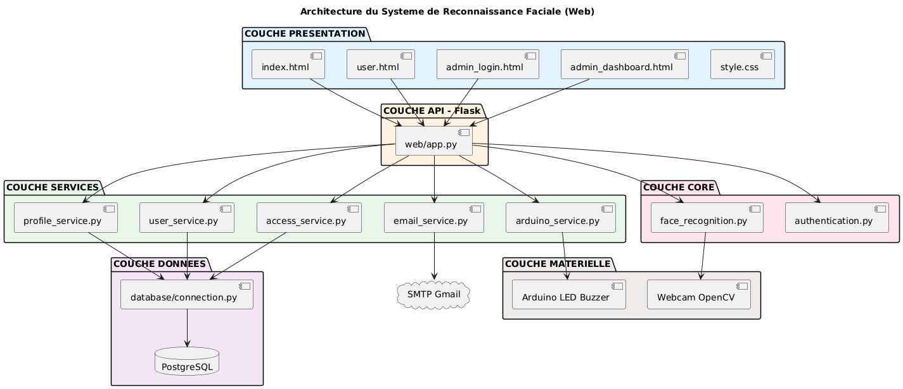
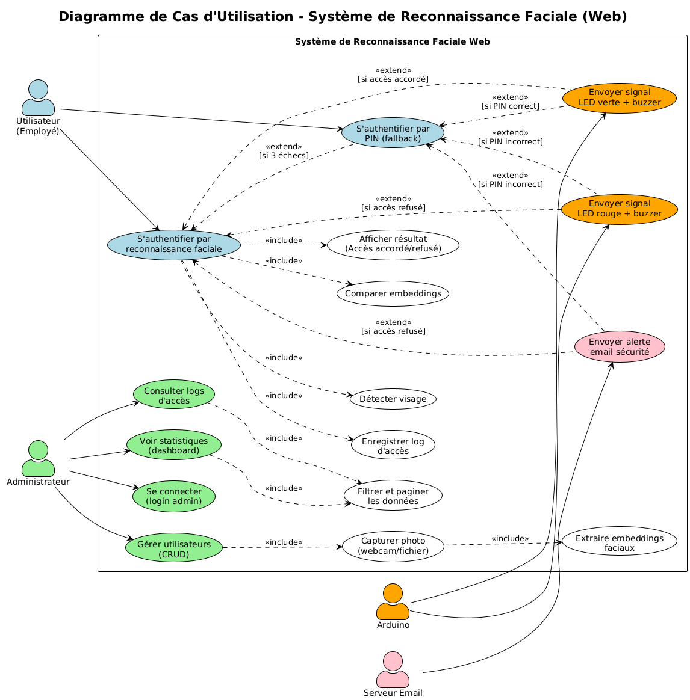
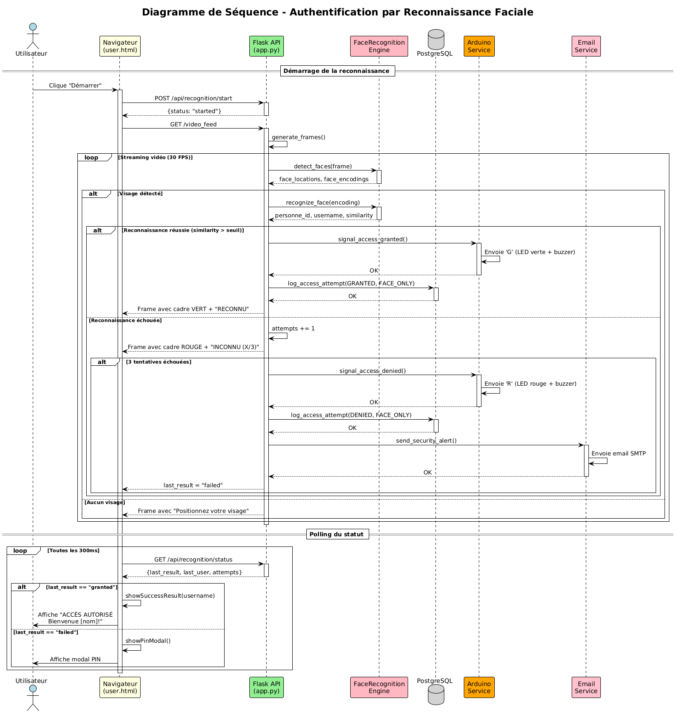
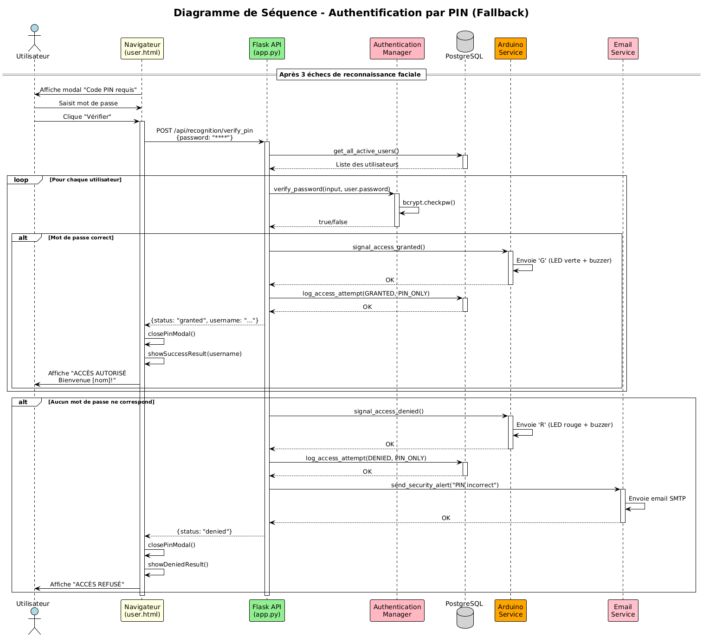
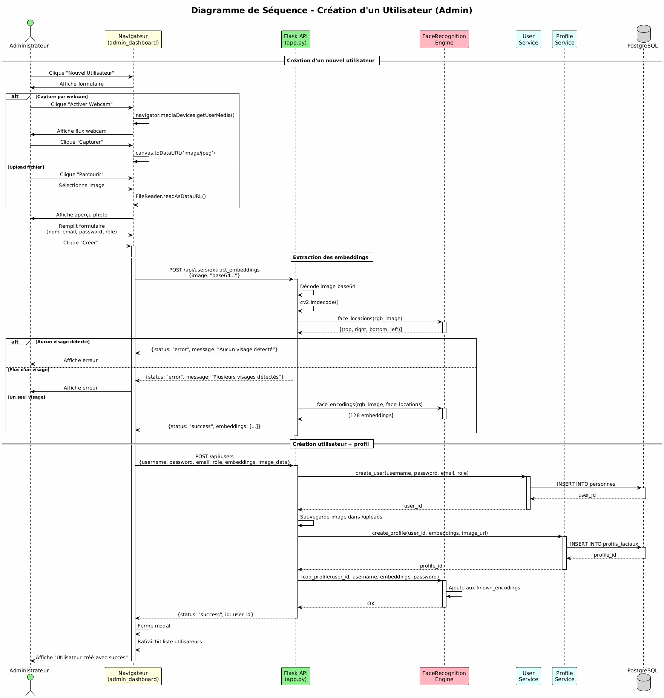

# Documentation - Système de Reconnaissance Faciale (Web)

## 1. Architecture du Système



Le système est organisé en **6 couches**:

| Couche | Rôle | Fichiers |
|--------|------|----------|
| **Présentation** | Interface utilisateur HTML/CSS | `index.html`, `user.html`, `admin_*.html` |
| **API Flask** | Routes et endpoints REST | `web/app.py` |
| **Services** | Logique métier | `user_service`, `access_service`, `arduino_service`, `email_service` |
| **Core** | Reconnaissance faciale et authentification | `face_recognition.py`, `authentication.py` |
| **Données** | Persistance PostgreSQL | `database/connection.py`, `models.py` |
| **Matérielle** | Webcam (OpenCV) + Arduino (LED/Buzzer) | Périphériques physiques |

---

## 2. Cas d'Utilisation



### Acteurs

| Acteur | Description |
|--------|-------------|
| **Utilisateur** | Employé qui s'authentifie pour accéder |
| **Administrateur** | Gère les utilisateurs et consulte les logs |
| **Arduino** | Signale visuellement l'accès (LED verte/rouge) |
| **Serveur Email** | Envoie les alertes de sécurité |

### Fonctionnalités principales

| Utilisateur | Administrateur |
|-------------|----------------|
| S'authentifier par visage | Se connecter au dashboard |
| S'authentifier par PIN | Créer/Modifier/Supprimer utilisateurs |
| | Consulter les logs d'accès |
| | Voir les statistiques |

---

## 3. Séquence - Reconnaissance Faciale



### Flux principal

```
1. Utilisateur clique "Démarrer"
2. Système active le streaming vidéo
3. Détection du visage (OpenCV)
4. Extraction des embeddings (128 caractéristiques)
5. Comparaison avec les profils enregistrés
6. Si correspondance → ACCÈS AUTORISÉ
   - Signal Arduino (LED verte)
   - Log en base de données
7. Si échec (3 tentatives) → ACCÈS REFUSÉ
   - Signal Arduino (LED rouge)
   - Email d'alerte
   - Affichage modal PIN
```

---

## 4. Séquence - Authentification PIN



### Flux (après 3 échecs de reconnaissance)

```
1. Modal PIN s'affiche
2. Utilisateur saisit son mot de passe
3. Vérification bcrypt contre la base
4. Si correct → ACCÈS AUTORISÉ (PIN_ONLY)
5. Si incorrect → ACCÈS REFUSÉ + Email alerte
```

---

## 5. Séquence - Création Utilisateur (Admin)



### Flux

```
1. Admin ouvre le formulaire
2. Capture photo (webcam ou fichier)
3. Extraction des embeddings faciaux
4. Création utilisateur en base
5. Création profil facial
6. Chargement dans le moteur de reconnaissance
```

---

## 6. Endpoints API

| Endpoint | Méthode | Description |
|----------|---------|-------------|
| `/api/recognition/start` | POST | Démarre la reconnaissance |
| `/api/recognition/stop` | POST | Arrête la reconnaissance |
| `/api/recognition/status` | GET | État actuel (attempts, result) |
| `/api/recognition/verify_pin` | POST | Vérifie le mot de passe |
| `/api/users` | GET/POST | Liste / Crée utilisateur |
| `/api/users/<id>` | PUT/DELETE | Modifie / Supprime |
| `/api/users/extract_embeddings` | POST | Extrait embeddings d'une photo |
| `/api/logs` | GET | Logs d'accès |
| `/api/stats` | GET | Statistiques dashboard |
| `/api/auth/admin_login` | POST | Connexion admin |

---

## 7. Technologies

| Composant | Technologie |
|-----------|-------------|
| Backend | Python 3.10 + Flask |
| Frontend | HTML5, CSS3, JavaScript |
| Base de données | PostgreSQL |
| Reconnaissance faciale | face_recognition + dlib |
| Vidéo | OpenCV (cv2) |
| Hardware | Arduino (pyserial) |
| Email | SMTP Gmail |

---

## 8. Lancement

```bash
# Lancer le serveur web
python run_web.py

# Accéder à l'application
http://localhost:5000
```

| Page | URL |
|------|-----|
| Accueil | `/` |
| Reconnaissance | `/user` |
| Login Admin | `/admin` |
| Dashboard | `/admin/dashboard` |
